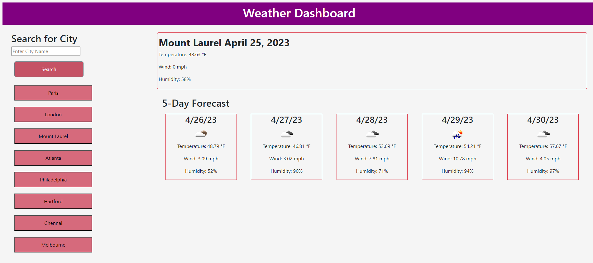

# Weather Dashboard

## Description

This is an application to see different weather around the world. You can search the city and the current weather will show as well as a 5 day forecast. This application was made using HTML, CSS, and JavaScript.

## Installation

N/A

## Usage

1. Enter city name
2. Click search
3. Refresh the page and history of past searches are there

## Screenshot

## Links to Deployment

https://github.com/MegMathis/weather_dashboard
https://megmathis.github.io/weather_dashboard/

## Credits

https://openweathermap.org/

https://developer.mozilla.org/en-US/docs/Web/API/Window/localStorage

https://www.youtube.com/watch?v=01WtuEiF4G8

https://www.businessinsider.com/guides/tech/degree-symbol-on-keyboard#:~:text=The%20degree%20symbol%20code%20is%20Alt%20%2B%200176.

https://www.youtube.com/watch?v=nGVoHEZojiQ

https://openweathermap.org/weather-conditions

https://www.freecodecamp.org/news/javascript-get-current-date-todays-date-in-js/#:~:text=In%20JavaScript%2C%20we%20can%20easily,%2C%20time%2C%20and%20time%20zone.

https://getbootstrap.com/

Tutoring by Jose

Tutoring by John

Office Hours

## License

Please refer to LICENSE in rep
