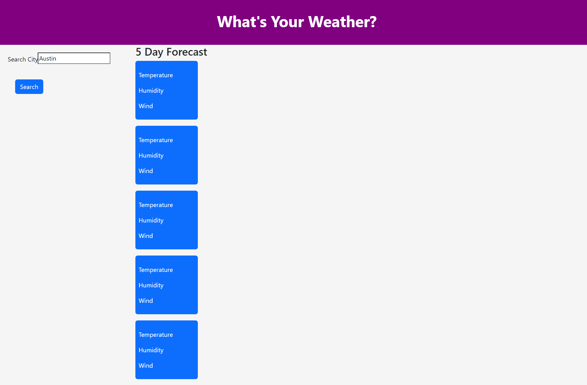

# Weather Dashboard

## Description

This is an application to see different weather around the world. You can search the city and the current weather will show as well as a 5 day forecast. This application was made using HTML, CSS, and JavaScript.

## Installation

N/A

## Usage

1. Enter city name
2. Click search
3. Refresh the page and history of past searches are there

## Screenshot

## Links to Deployment

https://github.com/MegMathis/weather_dashboard
https://megmathis.github.io/weather_dashboard/

## Credits

https://openweathermap.org/

Tutoring by Jose

## License

Please refer to LICENSE in rep
